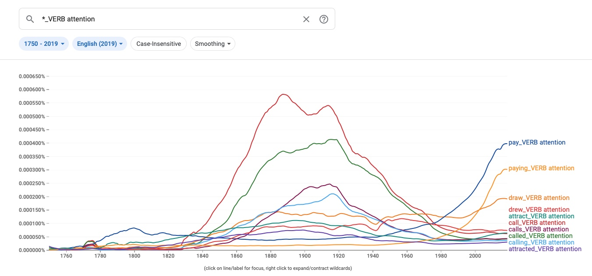

## Outline

- recap + reading
- methodological foundation  :grimacing:
- first computational text analysis

::: notes

- kurzfristige Umstellung auf Zoom
- Diskussion Survey Seminarerwartungen
  - 3/4 mit R-Erfahrung, wenige mit Python und Kommandozeile
  - SoCom Leute mit Inhaltsanalyse, keine Daten in Aussicht
  - Einführungskurs, aber komplementäres Wissen und Pointers für Fortgeschrittene
  - Skills für Seminar/BA-Arbeiten
  - allgemeine Programmier- und Computerkenntnisse
- Fragen zu Inhalt/Website?
- Diskussion letzte Sitzung + Paper
- Hauptteil: Bedeutung/Grundlage von Textanalyse
  - Auf welcher methodischen Grundlage steht das Feld?
  - Qualitativer Anteil gegenüber letzten Sitzung herausheben
- zweite Lektion: erste Textanalyse
  - einfach, aber mächtig

:::

## Recap last Lecture

:::::::::::::: {.columns}
::: {.column width="50%"}
### computer as ...

- ... an intelligent device
- ... a tool for a *new* social science

:::
::: {.column width="50%"}

### datafication

- abundance of data
- exploit new form of data

:::
::::::::::::::

::: notes

- Technologie verändert Welt. Seit immer, erneut grosser Schritt nach Industrialisierung.
- Computer als Werkzeug/interaktiver Partner
  1. nehmen an sozialen Prozessen teil -> wie verändert sich das Soziale/Ökonomische (Wissenschaft, Arbeit, Jobmarkt, Benachteiligung)?
  2. für CSS: Daten wichtiger als ML
- Daten sind da -> erst Programmieren ermöglicht Auswertung

:::

## Reading{data-background=#3c70b5}

#### Computational Social Science [@Lazer2009]

. . .

- data-driven
- network analysis + text analysis
- historical perspective vs. real-time dynamics
- issues: limited access to data and new methods

::: notes

- hochaktuell: Einsichten in Pandemiegeschehen durch Netzwerkanalyse
- methodical focus because of Nature paper
- more than self-reported data (survey)
- tlw. schwieriger Zugang
  - organisationsintern Daten und Datenschutz
  - historische und textuelle Daten einfacher zugänglich

:::

## Semiotic Triangle

:::::::::::::: {.columns}
::: {.column}

### Loose coupling between

- World
- Cognition
- Language

:::

::: {.column}

![Semiotic Triangle [@Ogden1923]](../images/ogden_semiotic_triangle.png)

:::

::::::::::::::

::: notes

- Was ist Sprache? 
  - Keine Philosophie-Vorlesung
  - technisch auch von Bedeutung
- Versuch der Einheit: Ding, Konzept und Wort
- keine direkte Beziehung zwischen Symbol & Gegenstand
  - keine Eineindeutigkeit wie in Datenbanken --> schwierig für Computer
    - identische Personen- und Ortsnamen
    - umfasst Früchte auch Hülsenfrüchte?
  - jede Ecke kann wechseln
    - Gleiches heisst anders, anderes heisst gleich

:::

##

> Language shapes the way we think,  
> and determines what we can think about.
> 
> <cite>Benjamin Lee Whorf</cite>

::: notes

- zweiteilige These umstritten (Sapir-Whorf-Hypothese)
  - Sprache formt das Denken
  - unabhängig der Determination: überragende Bedeutung für das Soziale
  - Inuit-Anekdote zu Schnee bedingt durch Grammatik
- Sprache ist das Soziale schlechthin
  - Vermittlungsmedium
  - weitere Formen: Zeichnen, Mathematik, Fotos
- wenn nicht kommuniziert, dann gesellschaftlich ohne Bedeutung (aber nicht unbedingt unvorstellbar)
  - Wörter sind Unterscheidungen
  - Link zu Luhmann
- Aktuelles Beispiel Ukraine-Krieg
  - Konflikt vs Krieg (Gewalt) vs Invasion (asymmetrisch), militärische Operation
  - Definitionskampf ist gut erkennbar von Russland, aber auch allen anderen

:::

# Working with Texts

## A micro and macro perspective I

### individual cases vs. collective trends

:::::::::::::: {.columns}
::: {.column}

](../images/close_reading.png){height=10cm}

:::
::: {.column}

](../images/nlp-natural-language-processing.jpg){height=10cm}

:::
::::::::::::::

::: notes

- Nun klar, wieso Textanalyse wichtig, aber welche Herangehensweise?
- Traditionell
  - Inhaltsanalyse, close reading
  - Einzeldokumente
  - lange Zeit alternativlos
- computergestützte Textanalyse
  - NLP, distant reading
  - Textsammlungen
- Rauszoomen bringt mehr/neues Verständnis, nicht nur Reinzoomen
- Methodik ändert evtl. Fragestellung
  - NLP: nicht Individuum, sondern Diskurs/Gesellschaft/Gruppe
  - strukturelle Beschreibungen und Kultur/Stimmung

:::

## A micro and macro perspective II

### scalability vs. abstraction

:::::::::::::: {.columns}
::: {.column}

](../images/newspapers-in-pile.jpg){height=10cm}

:::
::: {.column}

](../images/numbers_unsplash.jpg){height=10cm}

:::
::::::::::::::

::: notes

- je ein Problem je Approach
  - close: nicht skalierbar
    - ist das generalisierbar?
  - distant: kontextlos, da Narrativ/Einzelheiten verloren gehen
    - verlieren wer/was/wo/wie/wann/warum
    - was bedeuten Zahlen? Verweis: BIP (informelle Wirtschaft)

:::

## From micro to macro :bar_chart: ...and back again :bookmark_tabs:{data-background=var(--green)}

::: notes

- Lösung: Vogelperspektive, dann Eintauchen und zurück
- Gute Data Science besteht aus guter Kenntnis von Daten
- Grösser nicht immer besser

:::

## Two Research Paradigms

#### data exploration vs. hypothesis testing [@Evans2016]

- add nuance
- develop new narratives
- verify hypothesis

::: notes

- genauere Einordnung: exaktere Epochenbestimmung
- Agnostik/Induktion ausnutzen für anderes Narrativ
  - data-driven Diskurs ordnen

- Modelvorhersagen zu Kausalitätsaussagen
  - z.B. Klimawandel Berichterstattung -> Erfolg grüne Partei?
  - Metadaten zu Kommunikationsflüsse nötig

:::

---

## Numbers do not talk :no_mouth: {data-background=#4d7e65}

. . .

Thus, quantification and qualitative analysis go well together. 

::: notes

- alter Konflikt Quali/Quanti
  - beide Lager kritisch gegenüber NLP
  - zu wenig rigoros, zu naiv mangels Kontext
- Zahlen sprechen nicht für sich selbst
- komplementär

:::

## Text as Data 

- synonymy
- ambiguities
- compositonality of meaning
- discrete symbols
- unstructured, messy data

[see also @Grimmer2013]

::: notes

- Link zu semiotischem Dreieck
- Text inhärent schwierig
  - herausfordernste Datenform
  - Front der AI
- Wörter = diskrete Symbole
  - nominales Skalenniveau
- compositional
  - grosse Mäuse, kleine Elefanten
- unstrukturiert
  - anders als Tabelle/Datenbank
  - unterschiedliche Datenformate

:::

## Unstructured Text? :thinking:

### collection > documents > paragraphs > sentences > words

# Data Formats

## In-class Task: File Types {data-background=#3c70b5}

:::{.columns .blockstyle}

- What file formats do you know?
- Open files of different types in a text editor.  
  Which ones look good?

:::

::: notes

- Problem ist nicht wirklich der Text, sondern das Format
- alle möglichen Filetypen, nicht nur Text
  - zip/tar, exe, dmg/iso, jpg/png/gif
- öffnen von Editor?
- Dateiendungen aktiviert auf Computer?

:::

## File Formats

- machine-readability
  - raw:  txt, csv, tsv
  - formatted: docx, pdf, html, xml 
- open vs. proprietary
- digital sustainability

::: notes

- am besten raw + open
- Papier altert langsamer als Software!
- **Pause**

:::

# Let's Dive into it! :sweat_drops:

## Counting ngrams

### [Google Ngram Viewer](https://books.google.com/ngrams) [@Michel2011]

- historical perspective with ngrams
- \>5.2 million books
- rise and fall of cultural ideas and phenomena 

::: notes

- Google Books
  - indexiert ganze (Uni-)Bibliotheken
  - in 2009 mehr als 4% aller veröffentlichter Bücher
- See how ideas evolve/change over time
- y: relative Worthäufigkeiten 
- x: Bücher indexiert nach Publikationsjahr
- publiziert in Science, kein klassiches SoWi Journal
  - disziplinare Grenzen brechen auf

:::

## In-Class Task: Investigate the Environmental Discourse{data-background=#3c70b5}

- What other terms have been used to describe nature?
  
  - e.g. environment
- What environmental issues are debated the strongest? When? 
  
  - e.g. nuclear power plant 
- Are there any differences between languages?
  
  - i.e. similar words with non-equivalent curves over time

### :dart:  What do you conclude from your observations? 

::: notes

- Dauer: 20 Minuten
- issues described by whom?
- Herumgehen + selbst ausprobieren
- Wikipedia nutzen

:::

## Refine your Queries

### check out case-sensitiveness, wildcards (\*) ​an​d ​operators :nerd_face:

| Operator | Description                                                  |
| -------- | ------------------------------------------------------------ |
| `+`      | sums multiple expressions into one to **aggregate trends**.  |
| `-`      | subtracts the expression on the right from the expression on the left,  giving you a way to **measure one ngram relative to another**. |
| `/`      | divides the expression on the left by the expression on the right,  which is useful for **isolating the behavior of an ngram with respect to another**. |
| `*`      | multiplies the expression on the left by the number on the right, making it easier to compare ngrams of very different frequencies. (Be sure to enclose the entire ngram in parentheses so that * isn't  interpreted as a wildcard.) |

## The raise of the Ngram **pay attention**

::: notes

- major shift: "call attention" -> "pay attention"
- externer Faktor (call) vs. aktives Verhalten (pay)
- pay attention as a form of currency
- Zusammenhang? Aufmerksamkeitsökonomie, Individualismus
- "if you don't want to call attention to yourself by giving an incorrect answer, then you should probably pay attention in class."

Ich höre verstehe dich: https://books.google.com/ngrams/graph?content=Ich%20h%C3%B6re%20dich%2Cich%20sehe%20dich%2Cich%20verstehe%20dich&year_start=1800&year_end=2019&corpus=31&smoothing=3&case_insensitive=true&direct_url=t4%3B%2CIch%20h%C3%B6re%20dich%3B%2Cc0%3B%2Cs0%3B%3BIch%20h%C3%B6re%20dich%3B%2Cc0%3B%3Bich%20h%C3%B6re%20dich%3B%2Cc0%3B%3BIch%20h%C3%B6re%20Dich%3B%2Cc0%3B%3Bich%20h%C3%B6re%20Dich%3B%2Cc0%3B.t4%3B%2Cich%20sehe%20dich%3B%2Cc0%3B%2Cs0%3B%3BIch%20sehe%20dich%3B%2Cc0%3B%3Bich%20sehe%20dich%3B%2Cc0%3B%3BIch%20sehe%20Dich%3B%2Cc0%3B%3Bich%20sehe%20Dich%3B%2Cc0%3B.t4%3B%2Cich%20verstehe%20dich%3B%2Cc0%3B%2Cs0%3B%3BIch%20verstehe%20dich%3B%2Cc0%3B%3Bich%20verstehe%20dich%3B%2Cc0%3B%3BIch%20verstehe%20Dich%3B%2Cc0%3B%3Bich%20verstehe%20Dich%3B%2Cc0&authuser=0

:::

## Remember :thumbsup: {data-background=#4d7e65}

Has the language evolved over time or the social perception?

. . .

 

**Both, most likely.** 

 

Similarly, language may vary across regions and communities.

::: notes

- Grosse Frage ist
  - Wird das gleiche anders benannt?
  - Geht es um was anderes?

- Link zu Odgen Dreieck von nicht fixer Beziehungen

:::

## No Culturomics but Meaning-Making

### phenomena in collective memory

- semantic drifts (meaning)
- lexical shifts (frequency)

**Read, read, read** to complement **stats** with context!

::: notes

- Änderung von kontextueller Verwendung oder Wortfrequenz

* Eigentum hat sich etabliert, Religion degeneriert

* Patterns EN
  * dessert=>*_ADJ
  * *=>public_ADJ
  * *=>personal_ADJ
* Pattern DE
  * Kulturen=>*_ADJ
  * Kinder=>*_ADJ

- only entire words, yet: _INF

:::

## Questions of Interpretation

### possible reasons of decreasing frequency

- loosing interest
- becoming an established fact
- new reference
  - `The Great War` &rarr;  `World War I`
- selection of data sources

::: notes

- numbers don't talk
- Kommunikation
  - Weisse Schafe nicht erwähnenswert, nur schwarze
  - Nachrichtenwerte
  - Themenkonjunkturen
- einzelne Wörter bilden schlechte Evidenzbasis

:::

## A Word of Caution{data-background=#b5533c}

The unknowns of Google Ngram Viewer

- index of books
  - genre, authors, quantity
- artifacts of digitalization

:nerd_face: use better alternative: [bookworm HathiTrust](https://bookworm.htrc.illinois.edu/develop/) 

::: notes

* Google: ~4% of all books ever published
* Compared to the 2009 versions, the 2012 and 2019 versions:
  * more books, improved OCR, improved library and publisher metadata.
  * ngrams across page boundaries, no ngrams across sentence boundaries
  * rule-based tokenization
* wissenschaftlicher Standard
  * Ziel: nicht Unfehlbarkeit, sondern methodisch nachvollziehbar und kritisierbar
  * zitierfähig

* HathiTrust
  * curated collection
  * filter by meta data

:::

## Interacting with Data

### It is a lense, not a map.

](../images/dikw_pyramid.svg)

::: notes

- Lens / transformation like biology/physics
  - allerdings keine Labordaten 
  - Soziales ohne ceteris paribus
- not just mapping but interacting
  - Daten erlauben neue Sicht
  - deshalb nicht CS überlassen

:::

## Prepare your System

1. backup files + update system :construction:
2. start installation with this [guide](https://aflueckiger.github.io/KED2023/materials/installation_guide.pdf) :construction_worker:

::: notes

- Nicht riskanter als anderes. Ein Backup gehört dazu, ein Datenverlust sicher nicht.
- Unklarheiten/Probleme unbedingt zurückmelden
- Wer hat Python schon installiert? Welches OS/Installer?

:::

# Questions?{data-background="../images/paint-anna-kolosyuk-unsplash.jpg" .white-text}

## References

